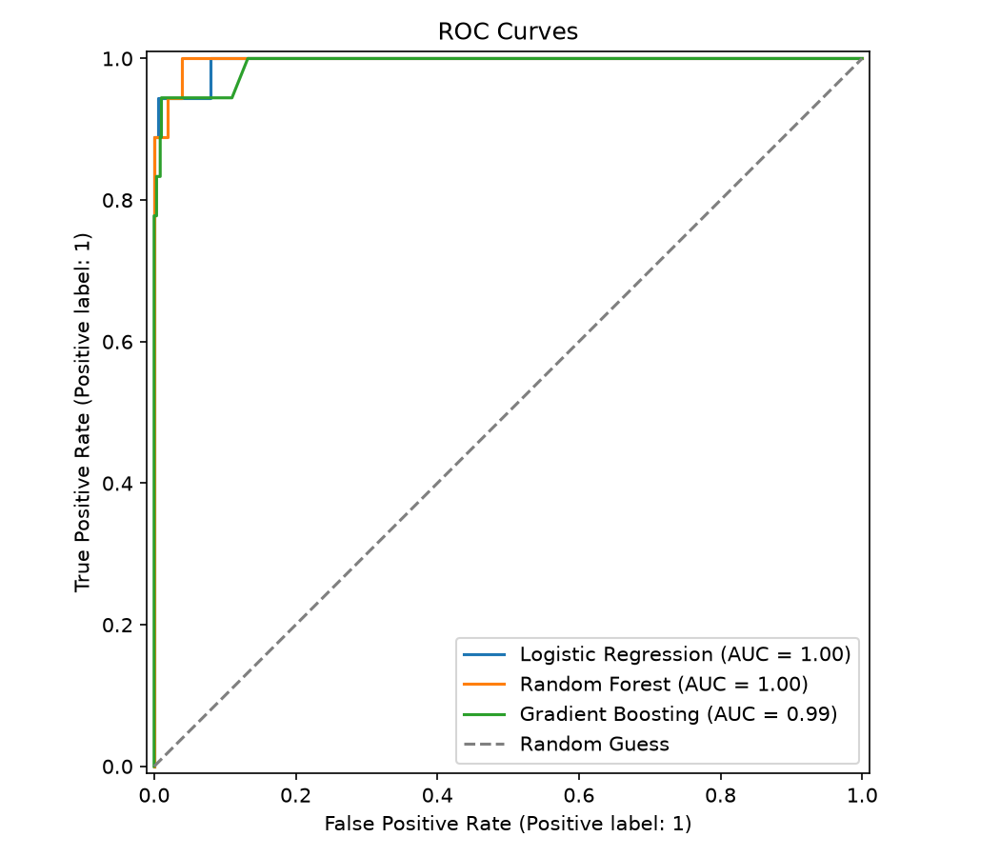

# Model Results and Interview Proof

Safe interview claim:

> I built a reusable scikit-learn fraud detection pipeline that loads data, handles missing values, uses a stratified split, trains three classifiers, compares them with imbalanced-class metrics and cross-validation, saves feature importance and plots, exports the best model, and serves predictions through FastAPI.

## What the repo proves today

- The test suite runs on generated demo data, so it does not require the large credit-card CSV.
- The CI workflow runs both tests and a quick training smoke test.
- `train.py` can run with `--use-sample` for a fresh-machine demo.
- The pipeline compares Logistic Regression, Random Forest, and Gradient Boosting.
- The project reports precision, recall, F1, ROC-AUC, and an always-legitimate baseline.
- `docs/demo-assets/sample-run/` contains a real sample training run with metrics, plots, and a saved model artifact.
- The training command exports `cross_validation_metrics.csv` and `feature_importance.csv`.
- `src/fraud_detection/api.py` exposes `/predict` for the final transaction-to-prediction demo.

## Included sample output

The included sample run selected Random Forest by F1 score on generated demo data:

| Model | Accuracy | Precision | Recall | F1 | ROC-AUC |
| --- | ---: | ---: | ---: | ---: | ---: |
| Always Legitimate Baseline | 0.9700 | 0.0000 | 0.0000 | 0.0000 | 0.5000 |
| Random Forest | 0.9950 | 1.0000 | 0.8333 | 0.9091 | 0.9968 |
| Logistic Regression | 0.9917 | 0.8421 | 0.8889 | 0.8649 | 0.9953 |
| Gradient Boosting | 0.9917 | 0.8824 | 0.8333 | 0.8571 | 0.9920 |



## Final ML Engineering Flow

```text
Transaction -> FastAPI -> trained model -> fraud prediction
```

This strengthens ML Engineering coverage without adding MLflow, feature stores, or a full MLOps platform.

## Important honesty note

The generated demo dataset proves the pipeline works. It does **not** prove real-world fraud performance. For real performance claims, run:

```bash
python -m fraud_detection.train --download-openml
```

or place the Kaggle `creditcard.csv` file in `data/` and run:

```bash
python -m fraud_detection.train --data-path data/creditcard.csv
```

Then summarize the final metrics here.

## What not to claim yet

- Production fraud detection system.
- Real banking deployment.
- Model monitoring.
- Feature store.
- Production live inference service.

## Simple next upgrade

Add request logging and a small batch-prediction endpoint after the single-transaction demo is stable.
